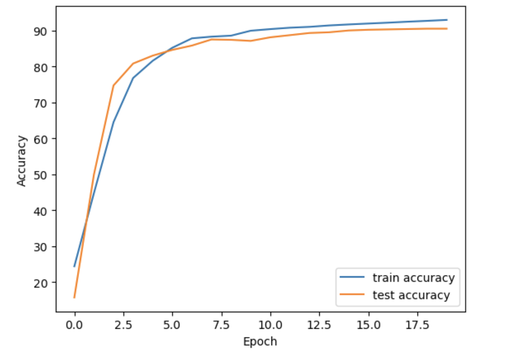

# MyTorchLite

MyTorchLite is a custom neural network library inspired by PyTorch, designed and implemented for educational purposes. It includes essential components such as tensors, layers, and optimizers, allowing users to create and train neural networks from scratch. This project specifically handles Multi-Layer Perceptron (MLP) architectures.

This project specifically handles Multi-Layer Perceptron (MLP) architectures and is inspired by [amirrezarajabi/rs-dl-framework](https://github.com/amirrezarajabi/rs-dl-framework?tab=readme-ov-file).

## Table of Contents
- [Installation](#installation)
- [Usage](#usage)
- [Components](#components)
- [Examples](#examples)
- [Contributing](#contributing)


## Installation

To install MyTorchLite, clone the repository and install the necessary dependencies:


```bash
pip install notebook
git clone https://github.com/alirezaghafari/MyTorchLite.git
cd MyTorchLite
python -m notebook
```

Open .ipynb files. then you can run them in jupyter environment.


## Usage
you can refer to the MNIST-mlp.ipynb notebook to implement your own MLP architecture and use the model to make predictions on the MNIST dataset. 

Additionally, you can explore the simple_neuron.ipynb notebook to learn how to train a single neuron model.

## Components

* Tensor

The `Tensor` class is a wrapper around NumPy arrays, providing support for automatic differentiation. It's responsible for applying computational operations and handling gradients within the network.

* Layer

The `Layer` class represents a neural network layer with weights and biases.

* Optimizer

The `Optimizer` class is an abstract class for different optimization algorithms. The `SGD` class is already implemented. You can implement your desired algorithm.


* Activation
This module includes various activation components for implementing activation functions, covering all the well-known activation functions such as ReLU, Sigmoid, Tanh, etc.

* Loss
This module includes the implementation of MSE and CrossEntopy loss functions.


## Examples

Error-Epoch Plot for my MLP architecture:



## Contributing

Contributions are welcome! Please fork the repository and submit a pull request with your changes.


